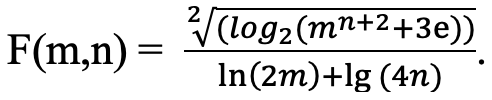

# Лабораторная 1. Вариант 2.

## Задача 1. Ошибка кассового аппарата 

У кассового аппарата возникла проблема вместо привычных продавцу десятичных чисел начал выдавать двоичные. Необходимо написать функцию `profit(int, str)`, которая будет высчитывать сумму прибыли за день с учетом последней покупки.

**Входные данные**

Первый параметр (десятичное число) — общая сумма купленных в магазине товаров на данный момент. 
Второй параметр (двоичное число) — сумма за последнюю покупку.

**Выходные данные**

Одно десятичное число — сумма прибыли за день с учётом последней покупки.

### Пример

**Входные данные**

```
123, “1101”
783, “10110111”
```

Выходные данные

```
136
966
```

## **Задача 2. Кадровая частота**

Напишите функцию `frame_rate(int, int)`, которая принимает количество минут и частоту кадров (FPS) и возвращает, сколько за это время кадров показывает компьютер при этом FPS.

**Входные данные**

Два натуральных числа:
```
 Количество минут
 Частота кадров
```
**Выходные данные**

Одно натуральное число

### Пример

**Входные данные**

```
10,1
1,1
```

Выходные данные

```
600
60
```

## Задача 3. Футбольные очки

Напишите функцию `calculate_points(int, int, int)`, которая принимает количество побед, ничейных игр и поражений и возвращает количество очков, которая набрала команда.

Очки набираются так:
* победы дают 3 очка;
* ничьи дают 1 очко;
* поражения дают 0 очков.

**Входные данные**

Три натуральных числа:
```
количество побед;
количество ничейных игр;
количество поражений.
```
**Выходные данные**

Одно натуральное число — количество очков

### Пример

**Входные данные**

```
3, 4, 2
5, 0, 2
0, 0, 1
```

Выходные данные

```
13
15
0
```

## **Задача 4. Выражение 2**

Напишите функцию `expression_func(int,int)`, которая вычисляет
значение 

Значение функции должно быть округлено до 2-х знаком после запятой.

Предполагается, что m,n натуральные числа.
**Входные данные**

Два натуральных числа.

**Выходные данные**

Значение F(m,n)

### Пример

**Входные данные**

```
2,3
```

Выходные данные

```
0.94
```

## **Задача 5. Интересное сложение**

Один малыш услышал от человека о некоем действии с числами — сложении. И как это часто бывает — он не до конца разобрался, как работает сложение. Например, не совсем понял, как произвести перенос разряда. Напишите функцию `sum_number(int, int)`, которая будет производить суммирование двух чисел без учета разрядности

**Входные данные**

Два натуральных числа меньше 1000

**Выходные данные**

Одно число — результат сложения введённых чисел без
учёта переносов.

### Пример

**Входные данные**

```
123,99
```

Выходные данные

```
112
```

**Подсказки**

* [Конкатенация строк](https://pythonworld.ru/tipy-dannyx-v-python/stroki-funkcii-i-metody-strok.html)
* [Преобразование str to int](https://proglib.io/p/kak-bystro-i-prosto-preobrazovat-tip-string-v-integer-na-python-2019-10-04)

## Примечание
**Запрещается использовать конструкции, которые не были пройдены на лекции №1 и №2. Например, while, if, for, map и т.д.**

## Дополнительные тесты

Файл `main.py` проверяется с помощью линтера [super_linter](https://github.com/wemake-services/wemake-python-styleguide?tab=readme-ov-file). При проверке игнорируются ошибки D, S, I.
