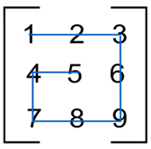

# Лабораторная 4. Вариант 6.
### Задача 1.Улитка
### Формулировка задачи
Реализуйте функцию `snail_path(list)`, которая принимает на вход матрицу и возвращает список элементов матрицы по порядку следования от левого верхнего элемента по часовой стрелке к внутреннему.  
Движение по матрице напоминает улитку  
  

###  Входные данные

Список списков(матрица) 
### Выходные данные

Список элементов
#### Пример 1

**Входные данные**

```
snail_path([[1, 2], [3, 4]])
```

Выходные данные

```
[1, 2, 4, 3]
```
#### Пример 2

**Входные данные**

```
snail_path([[1, 2, 3], [8, 9, 4], [7, 6, 5]])
```

Выходные данные

```
[1, 2, 3, 4, 5, 6, 7, 8, 9]
```
#### Пример 3

**Входные данные**

```
snail_path([['b', 'c', 'a'], ['3', True, 11], [None, 'foo', 0]])
```

Выходные данные

```
['b', 'c', 'a', 11, 0, 'foo', None, '3', True]
```
#### Дополнительные тесты

Файл `main.py` проверяеться с помощью линтера [super_linter](https://github.com/wemake-services/wemake-python-styleguide?tab=readme-ov-file). При проверке игнорируються ошибки D, S, I.
